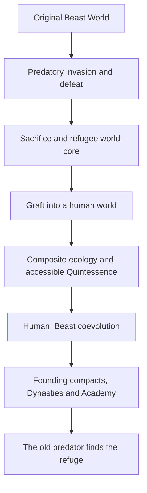

# Pass 55 — Origin world-graft, symbiogenesis and young-protagonist reconstruction

**Date:** 2026-09-05  
**Status:** `RECONCILIATION / SOURCE RECONSTRUCTION / WEB RESEARCH / SINGLE-AXIS DEVELOPMENT / NOT-CANON / NO SCENE / NO PROMOTION`  
**Primary source:** `BW-SRC-AUTHOR-2026-09-05-ORIGIN-WORLD-GRAFT-SYMBIOGENESIS-YOUNG-PROTAGONIST`  
**Predecessor:** Pass 54, now `SUPERSEDED AS ACTIVE ROUTE / RETAINED IN PART`  
**Guardrail:** Pass 50D remains active. Passes 50A–50C remain COLD except for regression prevention.
**Notion mirror:** `https://app.notion.com/p/3d242424cdbc8171b7e7f8c9d9e72fc7`

## 1. Honest verdict

This brainstorm is not evidence that the author lacks talent. It contains the first current architecture that makes most of BeastWorld's major promises feel like consequences of one event rather than a collection of attractive systems.

Its strongest achievement is causal:

> A defeated Beast ecology survives by becoming part of a human world; everything called BeastWorld is the unfinished consequence of that symbiosis, and the civilization that destroyed the first world eventually comes to finish the hunt.

That sentence can generate ecology, Blood, Matrix, Generated Beasts, Dynasties, Academy, portals, war, discovery, combat progression and the protagonist's place in history. The prior succession-only model could not.

The brainstorm is **not yet a usable story bible**. It is overfull, repeats variants, sometimes solves a local question by creating a larger cosmological liability and uses emotionally useful but technically unstable terms. If canonized verbatim it would produce new confusion. The correct response is therefore neither praise-and-lock nor rejection: preserve it exactly, extract the causal spine, repair its weak joints and ask the author to validate the refined model.

## 2. Integrity result

The supplied Markdown export and the current Notion page contain the same text after whitespace and Markdown-escape normalization. No material was lost between those copies. The raw source is preserved separately and the original Notion page must remain untouched as evidence.

The semantic source record distinguishes:

- direct author intent;
- recovered but unpromoted prior directions;
- explicit withdrawals;
- open questions;
- likely transcription hazards;
- integrator proposals introduced below.

## 3. The causal spine discovered by the author

This spine answers previously detached questions:

| Existing question | Answer created by the new origin |
|---|---|
| Why are humans and Beasts bound? | Each supplies a survival capacity the other lineage lacked. |
| Why does Blood matter? | It is a living calibration medium derived from preserved Beast-world patterns and the composite world's matter. |
| Why does the Matrix exist? | It is the cultivated interface that makes cross-lineage resonance and new personhood possible. |
| Why do Generated Beasts exist? | The refugee ecology regenerates and evolves through reciprocal human–Beast lives rather than simple reproduction of the dead world. |
| Why are there founding Dynasties? | Founder compacts organized survival, regional anchors and knowledge during the composite world's formation. |
| Why does the Academy exist? | A composite civilization needs interregional training, research, defense and integration that no Dynasty can perform alone. |
| Why do portals matter now? | They are the return path of the predator and later the frontier of a world that has learned to connect. |
| Why is civilization progressing? | The world is still completing an unprecedented ecological and cultural merger under renewed pressure. |
| Why is the protagonist historically unusual? | His mixed pattern and Direct Concession may express the composite world's next integration problem, not a random chosen-one bonus. |

## 4. The exact conceptual upgrade

Pass 54 correctly recovered action, portals, progression and purpose but still treated them as three engines placed beside one another. Pass 55 supplies the relation beneath them:

- **operational engine:** renewed Fissures are the predator's search, probing and eventual campaign;
- **personal engine:** the protagonist is a person through whom the composite world's unfinished integration becomes unusually intense;
- **civilizational engine:** humans, Beasts and institutions must out-adapt an enemy civilization that turns other life into fuel;
- **thematic engine:** can reciprocal evolution defeat extractive evolution without adopting its logic?

That last question is the strongest series-level thematic proposition currently available. It is a proposal for validation, not canon.

## 5. Repairs required before the idea is stable

### 5.1 Do not send a literal planet fragment drifting through ordinary space

The raw image is powerful but creates unwanted astrophysical questions: mass, collision, gravity, travel time and why no one sees a planetary object arrive. It also makes later portal logic harder.

**Leading repair — `refugee world-seed` as a backstage term:** the sacrificed world compresses a viable ecological kernel into the same interworld medium later used by Fissures. The kernel carries some real matter, living substrates, organized Quintessence, lineage patterns and memory, but not a miniature planet. It grafts into the host through multiple ecological anchors.

This retains the physicality the author wants while making the fusion a magical-biological event rather than an accidental celestial impact. `World-seed`, `ark-matrix` and `graft` are integrator vocabulary only; no in-world name is selected.

### 5.2 Separate Living World from astronomical star

The transcript uses `estrela`, planet and world interchangeably. The setting needs a backstage distinction:

- **astronomical star:** the sun;
- **Living World:** the inhabited planetary/ecological whole;
- **world-core:** the deep coupling structure that organizes Quintessence, matter and life;
- **world-function:** a differentiated governing intelligence within that whole;
- **Fissure/interstice:** the interface between Living Worlds.

Characters may still use poetic or historical terminology, but the production bible cannot.

### 5.3 The four entities should be survivors/functions, not creators of every species

If four animal-coded beings generated all life, every Beast becomes an elemental family member and the premise moves dangerously close to familiar five-element guardian structures. A richer model is:

- the old Beast World had vast independent biodiversity;
- the surviving entities were major ecological regulators/archives, not external creators;
- four may be the number that survived or the number of stable anchor functions in the graft, not a cosmic law;
- each preserves many incompatible lineages and ecological processes, not one animal clan;
- new Beast life arises through retained archives, mutation, host fauna, ecological recombination and Generated persons.

Dragon/Phoenix/Oceanic/Qilin motifs can remain historical human interpretations rather than exhaustive biology.

### 5.4 Replace evolutionary destiny with adaptive continuity

Real evolution has no built-in upward destination. Symbiosis, predation and cooperation are context-dependent strategies, and evolutionary arms races can oscillate or destroy participants. The story becomes more intelligent if neither world is metaphysically assigned to `progress`.

The governing entities seek **continuity, viability and freedom to keep becoming** after a near-extinction event. Human and Beast partners choose mutualism as a strategy and ethic. The predator civilization chooses extraction/forced assimilation because it has historically worked. Both can become more capable; only one preserves reciprocal agency.

This is grounded by research on symbiogenesis, niche construction, cumulative culture and Red Queen coevolution, while remaining fiction rather than a claim of literal planetary biology.

### 5.5 The old Beasts did not lose because humans are superior

The cleanest causal asymmetry is:

- old Beast ecologies possessed enormous embodied power and deep local adaptation;
- they were specialized by biome/lineage and lacked fast cross-biome coordination, transferable abstraction, logistics and cumulative institutions;
- the predator civilization already combined portal warfare, captured traits, artifact/technique development and coordinated mixed forces;
- humans contribute cumulative culture, portable tools, organization and rapid recombination of knowledge;
- Beast life contributes Quintessence embodiment, ecological memory, nonhuman perception and transformative biology.

Neither side is complete. BeastWorld is a new survival form, not a human upgrade installed on inferior animals.

### 5.6 The entities cannot download civilization into founders

The entities can transmit sensations, patterns, danger memories, ecological relations and partial techniques. Humans must invent notation, test procedures, fail, compare results and institutionalize knowledge. This gives the world's three millennia real history and makes Academy research necessary.

### 5.7 Primordial Blood needs reproduction without an infinite faucet

The preserved original substance works best as a **living template and catalyst**, not a tank slowly emptied over millennia. A world-function can synthesize new Blood from:

> preserved lineage pattern + composite-world matter + Quintessence + active calibration + recipient biology.

Dynastic Blood preparations and refined materials can work. Direct Concession remains distinct because the entity actively recognizes, calibrates and enters a reciprocal bond with the recipient. This is more dramatic and more coherent than visible purity percentages.

### 5.8 Make the entities load-bearing

Their post-sacrifice existence is part of the world's infrastructure. Pulling too much coherent agency/power out of an anchor damages the ecology it regulates. Material aspects therefore have bounded throughput, distance and duration. They can warn, teach, negotiate, select and occasionally intervene, but cannot abandon the world and fight every war.

This converts `why do the gods not solve it?` into a consequence of their survival act.

### 5.9 Dynasties should grow from anchor compacts, not elemental mascot nations

Each founding sovereignty can be shaped by geography, prior human culture, a regional graft-zone, responsibilities and the founder's political choices. Its Beast motif is one strand. Three millennia of migration, marriage, merit admission, internal factions and technology prevent four color-coded nations.

The source strengthens the prior correction that the Dynasties themselves may be crowns/sovereignties. A powerless independent crown is unnecessary unless later governance design establishes a real function.

### 5.10 Do not tie the enemy's return causally to the protagonist's birth or Concession

That would turn him into a cosmic alarm bell and make the world wait for its chosen one. Better:

- the enemy has been searching through old scars for generations;
- rare Fissures and probes already exist;
- the campaign becomes coordinated around his adolescence for strategic reasons outside him;
- his Concession lets him perceive or survive an aspect of the old signature, so he becomes relevant after the threat is already real.

He does not summon the plot. He is caught by it and chooses how to respond.

### 5.11 Do not let postwar absorption make BeastWorld the new predator

`Defeat enemy → absorb world → become stronger → attract stronger world` is a clean escalation loop but a thematic betrayal and an infinite-power machine. A better family of later possibilities is:

- liberate captive ecologies and peoples;
- quarantine contaminated anchors;
- salvage knowledge/material under ethical conflict;
- negotiate a bounded graft requested by survivors;
- refuse extraction even when it would grant decisive power.

If BeastWorld incorporates anything, the cost and consent question must return to characters and institutions.

## 6. Research base and what it actually supports

### 6.1 Scientific analogies

| Research | Transferable insight | Boundary |
|---|---|---|
| [Symbiogenesis review](https://www.sciencedirect.com/science/article/pii/S0022519317303612) | major novelty can emerge through organisms becoming by living together | does not prove a conscious planet can merge with another |
| [Endosymbiosis and evolutionary innovation](https://pmc.ncbi.nlm.nih.gov/articles/PMC4547300/) | durable integration can create capabilities neither lineage possessed alone | analogy for the composite world, not a literal mechanism |
| [Niche construction review](https://pmc.ncbi.nlm.nih.gov/articles/PMC4261998/) | organisms alter environments that then reshape selection | supports reciprocal world/civilization change |
| [Human cumulative culture](https://pmc.ncbi.nlm.nih.gov/articles/PMC2781880/) | social learning can accumulate adaptive information across generations | supports the human contribution without species supremacism |
| [Host–microbiome principles](https://pmc.ncbi.nlm.nih.gov/articles/PMC4540581/) | host development and ecology can depend on associated organisms | useful for Matrix/Blood integration metaphors |
| [Critical review of holobiont claims](https://pmc.ncbi.nlm.nih.gov/articles/PMC4817262/) | cooperative wholes should not be treated as automatically unified evolutionary individuals | warns against saying all life becomes one harmonious super-organism |
| [Red Queen coevolution](https://pmc.ncbi.nlm.nih.gov/articles/PMC4240979/) | reciprocal conflict can produce fluctuating and directional adaptation | supports an enemy that learns back rather than a static monster ladder |
| [Planetary-scale intelligence](https://www.cambridge.org/core/journals/international-journal-of-astrobiology/article/intelligence-as-a-planetary-scale-process/5077C784D7FAC55F96072F7A7772C5E5) | coupled life and technology can be modeled as planetary-scale collective process | supports a Living World as distributed system more than a talking globe |

The creative inference is that BeastWorld should behave as a contested composite/holobiont, not as a perfectly unified super-organism. Cooperation must be maintained through relationships, institutions and conflict.

### 6.2 Fiction and animation reference audit

| Work | Function worth studying | Originality boundary for BeastWorld |
|---|---|---|
| [*World Trigger*](https://www.viz.com/blog/posts/world-trigger-1-and-2-2389) | gates, defense organization, team specialization and tactically readable action | do not copy Triggers, Neighbor taxonomy or Rank Wars; BeastWorld's living ecology and Blood/Matrix reciprocity must dominate |
| [*World Trigger* Rank Wars](https://www.viz.com/blog/posts/world-trigger-vol-5) | competition can teach tactics and reveal ensemble competence | Academy competition must feed real ecological/war problems, not become the whole premise |
| [*Kaiju No. 8*](https://www.viz.com/kaiju-no-8) | defense institution, monster-derived capability and personal/institutional tension | avoid secret-kaiju identity and numbered-remains weapon template |
| [*The Beginning After the End*](https://tapas.io/series/tbate-comic/info) | great power can coexist with emptiness, relationships and a hidden external threat | no reincarnation skeleton and no prefabricated cultivation ladder |
| [*One-Punch Man*](https://www.viz.com/one-punch-man) | unmatched power can destroy challenge and purpose | the Director must face genuine limits and growth; his paradox cannot depend on gag invincibility |
| [*Solo Leveling*](https://yenpress.com/series/solo-leveling) | clean thresholds, impact, momentum and satisfying capability change | reject videogame System, numerical UI and ensemble eclipse |
| [*Solo Leveling* — Jeju/Beru volume](https://yenpress.com/titles/9798400900495-solo-leveling-vol-7-comic) | the author specifically values Jin-Woo/Beru for presence, audiovisual impact, reveal and escalation | extract encounter grammar, not its solo-progression monopoly |
| [*Nano Machine*](https://www.webtoons.com/en/action/nano-machine/list?title_no=4344) | martial institution, succession pressure and concrete technical progression | Blood/Matrix cannot become a nanotech cheat that solves learning |
| *Fog Hill of Five Elements* | body/weapon readability fused with speed and elemental spectacle | strict quarantine on guardian families, elemental taxonomy and Qilin-centered lore |
| [*Hunter × Hunter*](https://www.viz.com/blog/posts/welcome-to-hunter-x-hunter) | latent talent still requires learned control; conditions, information and matchup can keep raw strength from answering everything | do not reproduce Nen categories or arena progression |
| [Goku versus Beerus](https://en.dragon-ball-official.com/news/01_689.html) | an apparently supreme fighter discovers a radically higher local ceiling; cosmic scale can still retain personality | use once as horizon expansion, not as permission for an endless procession of larger gods |
| [*Final Fantasy VII* official description](https://etailers.square-enix-games.com/etailer/347939?e=Digital+Deluxe&p=Nintendo+Switch+2&s=Nintendo) | planetary life-cycle, extraction and an alien calamity create ecological stakes | strongest collision risk: avoid Lifestream analog, awakened planetary Weapons and alien-calamity beats; refugee symbiogenesis and generated personhood must distinguish BeastWorld |
| *Nausicaä of the Valley of the Wind* | ecology should exceed human moral labels; war can weaponize living systems | do not import purifying toxic-forest revelation or ancient bioengineered caretaker solution |
| *Princess Mononoke* | human and nonhuman interests can be morally plural and materially costly | avoid simply restaging industry versus forest gods |
| [*Xenoblade Chronicles 3*](https://www.nintendo.com/us/store/products/xenoblade-chronicles-3-switch/) | a world-scale condition can be experienced through youthful bonds and war institutions | no fused-world ontology, endless-life-war machinery or role-copying |
| [*I Am an Evil God*](https://www.webcomicsapp.com/en/keyword/i-m-an-evil-god-manhwa) | distinct Worlds can force new local identities and techniques | crossings must change home and relationships; no disposable advancement realms |
| [*The Expanse*](https://store.orbit-books.co.uk/products/the-expanse-10-book-bundle-deal) | new routes/worlds widen politics while preserving a long alien mystery | retain martial mythic ecology rather than geopolitical science-fiction imitation |

No reference supplies BeastWorld's solution. Their value is diagnostic: they reveal useful functions and nearby imitation traps.

## 7. One series premise — selected for development, not promoted

> **BeastWorld is a refugee ecology born when the remains of a destroyed Beast World grafted into a human world. Three millennia later, the predatory civilization that caused the first extinction has found the refuge, forcing humans, Beasts and their institutions to prove whether reciprocal evolution can out-adapt conquest without becoming conquest.**

This is the only series premise Pass 55 develops. Succession, Oceanic lineage, romance, Academy competition, Generated Beasts and other Worlds are subordinate layers or consequences unless later author decisions elevate them.

## 8. One Book 1 narrative axis — selected for stress-test, not promoted

> **During the first coordinated campaign of Fissures, a fifteen-year-old scion of a founding Dynasty receives the first Direct Concession since the founders and must gain agency over a power everyone else reads as destiny, while evidence reveals that the attackers are the civilization that hunted the original Beast World into this refuge.**

Plain formulation:

> **His impossible Concession and the return of the ancient predator become the same generation's crisis.**

This is one axis, not two competing books. The Concession gives the external war a human center; the coordinated campaign prevents the character origin from collapsing into a school/palace plot.

### Axis objective

The protagonist wants to master enough of the new relationship/power to protect people during an escalating breach campaign and earn the right to choose what the Concession means for his life.

### Opposition

- his own unintegrated body/Matrix and lack of mastery;
- institutions and families trying to interpret the event before anyone understands it;
- an enemy probe architecture already learning from local defenses;
- a concrete champion/agent who can pressure him and embodies forced adaptation;
- time: each exchange teaches both civilizations.

### Irreversible Book 1 change

The world learns that recent Fissures are coordinated and connected to the extinction of the old Beast World; the protagonist becomes publicly inseparable from the renewed war, but not automatically sovereign or invincible.

No scene, specific breach, villain identity or ending battle is selected here.

## 9. Chronology recommendation

### Recommended: begin at fifteen and earn the adult Director

The new origin makes youth the stronger opening. The reader needs to experience:

- the gap between talent and mastery;
- the pre-Concession limitation;
- the entity's observed relationship with him;
- the first Direct Concession as a frightening reciprocal event rather than a lore anecdote;
- Academy friendships, rivalries and instructors before adult authority;
- credible defeats and adaptations;
- the cousin as a living peer, not a political dossier;
- the civilization discovering the enemy alongside his generation.

Beginning with the adult Director and explaining all this through flashbacks would put the most emotionally causal material in the rear-view mirror and recreate the project's exposition problem.

### Anti-generic safeguard

Starting young does not mean `generic chosen boy enters magic school`. He enters a mature, millennia-old composite civilization already under pressure. He has family, competence, doctrine and political location. The Academy is a defense/research city and inter-dynastic compact, not a house-sorting boarding school. His Direct Concession creates burden and possibility but does not supply mastery.

### Working temporal bridge

- **age 15:** pre-Academy selection/preparatory formation, visible limitation, coordinated Fissure turn, Direct Concession;
- **15–16:** bounded Oceanic stabilization/formation integrated with investigation and Academy institutions, not a detached training vacation;
- **age 16:** full Academy/cadet entry with a changed body, unfinished mastery and a threat now known to be strategic;
- **later books:** growth toward field command, teacher and Director;
- **ancient Founding:** revealed through evidence, entities, ruins and contradictory records; no mandatory cosmology prologue.

Durations are hypotheses.

## 10. Book 1 macro-architecture without scene design

| Movement | Character movement | External movement | World revelation |
|---|---|---|---|
| I — inherited world | capable but resonantly constrained heir seeks Academy trajectory and challenge | Fissures appear containable but patterns no longer fit accident | present civilization is confident, specialized and imperfectly integrated |
| II — impossible relation | Direct Concession opens capacity and destroys certainty; no mastery | separate incidents reveal coordination/adaptation | the governing entities recognize an old signature but possess incomplete memory/agency |
| III — costly formation | Oceanic/mixed-lineage stabilization, peers and first real defeat | enemy establishes a durable probe/bridgehead or infiltrative chain | Blood/Matrix are reciprocal interfaces that can also be studied or exploited |
| IV — collective counter | protagonist learns to fight with rather than around competent others | Academy/Dynasties mount a combined response while the enemy changes tactics | fragments of the lost world's defeat become operationally relevant |
| V — truth and commitment | he chooses protection and growth without surrendering authorship of himself | the immediate campaign is stopped/contained at a real cost, not the war ended | the old predator has found the refuge; the next era has begun |

This table is not an outline of chapters or scenes. Its purpose is to prove that the chosen axis can escalate character, action and revelation together.

## 11. Protagonist architecture

### 11.1 Why the Direct Concession can choose him without arbitrary destiny

Leading model:

- he carries two historically separated anchor-pattern inheritances;
- that mixture causes instability under orthodox methods;
- the composite Living World itself is a successful graft of unlike lineages;
- the observing entity recognizes in him not a royal entitlement but a rare viable integration problem;
- a crisis plus his prior choices demonstrate capacity for reciprocal bond;
- Direct Concession reorganizes conditions; it does not grant results.

This makes mixed lineage thematically resonant without saying `his genes are purer than everyone else's`.

### 11.2 His power appetite

His enjoyment of strength, danger and challenge should be visible while young, before adult responsibility rationalizes it. It is not a secret evil. It becomes dangerous when:

- he takes a fight because it is alive-making, not only necessary;
- he mistakes independence for efficiency;
- he underestimates how much others need to learn beside him;
- victory reinforces the identity of irreplaceable weapon;
- peace threatens meaning.

The long arc is not renouncing power. It is learning to wield, share, teach and survive meaning beyond being the strongest available answer.

### 11.3 Defeat grammar

He must be able to lose through different causes:

- body/Matrix incompatibility;
- superior experience or rule knowledge;
- opponent matchup/counter;
- foreign-world environmental mismatch;
- protecting an objective rather than winning a duel;
- command failure or refusal to coordinate;
- moral refusal to use an available exploit.

Each defeat should produce a different adaptation. Repeated `rage unlock` is blocked.

## 12. Family, cousin and Oceanic material inside the axis

The family is not a rival premise. It determines how the crisis feels.

### Father

He can be the protagonist's primary early martial measure: formidable, alive and able to disagree without being secretly evil or conveniently absent. His response to the Concession matters because he understands the cost of exceptional capability.

### Uncle/sovereign

He governs a real sovereignty. He cannot simply abdicate because an entity chose his nephew. He must balance family, compact obligations, defense and public interpretation.

### Cousin/heir

He remains the legitimate, prepared and powerful heir. Adolescent envy or friction is allowed because they are human; structural incompetence is not. His strongest dramatic function is to become one of the first people who refuses the false binary `either I am sovereign or my cousin is allowed to be exceptional`.

That loyalty gains weight only if the cousin also has combat agency, his own progression and decisions the protagonist cannot make for him.

### Mother and Oceanic line

Her origin can embody the fact that three millennia of BeastWorld cannot remain four sealed blood boxes. Mixed families are civilizational facts. Oceanic formation then serves body stabilization, maternal belonging, ecological range and a different martial philosophy—not exotic tourism.

### Succession pressure

People may interpret Direct Concession as sovereignty, but that pressure is a consequence, not Book 1's master engine. The story does not need a jealous heir or palace assassins to generate tension.

## 13. First enemy architecture

The enemy needs three scales simultaneously:

| Scale | Required function |
|---|---|
| ecological | organisms/phenomena make each crossing physically strange, dangerous and learnable |
| personal | one champion/agent has desires, methods and combat language capable of challenging the protagonist and peers |
| strategic | a faction/civilization turns encounters into information, footholds and adaptation |

### Recommended moral model

The predator world has built continuity through forced incorporation. Some citizens believe assimilation prevents extinction; elites profit from it; captive peoples survive inside it; dissidents know another mode may be possible. Its methods are genuinely atrocious without every organism being born metaphysically evil.

This preserves villains the reader can hate, monsters that can be fought brutally and the possibility of defectors or morally complex adversaries.

### Why it has not already won

- the refugee core severed or obscured its old signature;
- interworld routes require compatible scars/anchors and are expensive to stabilize;
- early probes carry limited mass/power/information;
- the composite world is no longer the specialized ecology the enemy defeated;
- three millennia of human–Beast institutions have created unexpected defenses;
- the enemy may have internal constraints, wars or factions.

No single reason is selected yet, but the final model must use at least a physical constraint and a strategic constraint.

## 14. Magic grammar — proposed unifier

The system should not be a list of elements. The leading common sentence is:

> **A practitioner uses the Matrix to couple embodied living pattern, Quintessence, intention/form and the surrounding environment into a temporary physical effect.**

This yields six variables:

1. **body:** what the practitioner can survive and physically execute;
2. **pattern:** inherited/cultivated Beast and personal organization;
3. **Quintessence:** available transformative capacity;
4. **resonance:** compatibility among practitioner, Beast, material and environment;
5. **form:** learned movement, geometry, weapon method, language or mental structure;
6. **exchange:** heat, strain, matter, injury, attention, ecological disturbance or another consequence.

Application families can include reinforcement, projection, pressure/vector manipulation, transmutation, binding, sensing, healing, artifact work, Dominance and domain-like environmental control. Elements describe favored interactions and ecologies, not character classes.

## 15. Combat progression without a videogame ladder

| Development band | Visible combat question | Typical new capability |
|---|---|---|
| embodied literacy | can the fighter read range, timing, mass and injury? | reinforcement, senses, recovery, weapon integration |
| stable resonance | can power survive motion and impact without breaking the user? | sustained enhancement, short projections, Beast coordination |
| external shaping | can intent/form organize the environment? | pressure, elements, terrain manipulation, bindings, movement bursts |
| rule interaction | can the fighter read and counter another pattern? | disruption, feints, anti-resonance, combined techniques |
| field authorship | can several objectives and allies be managed at once? | bounded domains, area control, command-scale coordination |
| interworld adaptation | what remains when the environment no longer agrees? | retuning, hybrid techniques, portable anchors, deliberate limits |

These are narrative development bands, not rank names. They permit the visual curve the author wants: grounded early physicality → faster and more spectacular expression → tactical high-power conflict that still has geometry and cost.

Traversal can use leaps, bursts, surfaces, weapon anchors, pressure steps and temporary support. Free sustained flight remains rare/special if it exists.

## 16. Ensemble minimum

Before scene work, Book 1 needs at least:

- protagonist;
- cousin/heir as independent high-potential peer;
- one non-family peer whose skill solves problems neither cousin can;
- one Beast/Generated person with agency and a trajectory not owned by the protagonist;
- one adult instructor/commander who can defeat or outthink him;
- one enemy champion;
- one enemy-side person who reveals internal plurality;
- one institutional researcher/medic/artificer whose work materially affects action.

No names or final roles are selected. This is a function test to prevent a universe populated by dossiers and one active fighter.

## 17. Expansion control

Later Worlds should form a **finite causal constellation**, not an infinite multiverse menu. Every new World must satisfy all five:

1. linked to the history/signature/route of the first conflict;
2. possesses a distinct ecology and civilization, not only a new power tier;
3. changes a known relationship or institution at home;
4. imposes a rule mismatch that demands adaptation;
5. leaves a durable consequence after departure.

Power portability should be asymmetric:

- body, experience, discipline and some internal pattern travel well;
- environment-dependent techniques degrade or behave differently;
- artifacts/anchors help at a cost;
- local cooperation can outperform brute transplantation;
- retuning produces hybrid knowledge that changes home.

This turns world travel into transformation rather than vacation or farming.

## 18. Originality audit

### Strongest distinctive combination

- the `fantasy planet` is a refugee graft, not a natural default;
- Beast bonding is part of ecological regeneration and new personhood;
- Primordial entities are sacrificed, load-bearing world-functions;
- humans contribute cumulative civilization to a nonhuman ecology that once lacked it;
- the enemy represents forced incorporation, creating an ethical mirror of the heroes' mutualism;
- the protagonist's mixed integration echoes the world's without making him its literal avatar;
- the adult strongest/Director is earned across a generational institutional arc.

### Highest collision risks

1. *Final Fantasy VII*: living planet, alien calamity, planetary defenders and life essence.
2. *Fog Hill*: elemental guardian families, Qilin and spectacular elemental martial combat.
3. generic cultivation/manhwa: blood purity, chosen inheritance, Academy ranks, game-like progression.
4. portal fantasy: repeated gates, monster raids and ever-higher tiers.
5. *Avatar/Mononoke*-like simplification: pure nature against corrupt civilization.

### Required differentiation rules

- Quintessence cannot function as renamed Lifestream/mana.
- governing entities are not awakened superweapons or animal gods.
- ecological conflict must include institutions, reciprocal invention and nonhuman agency.
- Blood is an interface/relationship, not aristocratic power score.
- the predator and refuge must differ by mode of incorporation and consent, not light versus dark colors.
- world crossings must remain causally finite.

## 19. What Pass 54 retains and loses

### Retained

- protection of the Living World and its lives as the Director's outward purpose;
- appetite for power, challenge and the possible void of becoming unnecessary;
- portal action, opponents, creatures, missions and civilizational progression as non-negotiable;
- three-scale engine discipline;
- enemy reciprocal adaptation/infiltration as a valuable operational behavior;
- fast supernatural combat with readable physical substrate;
- no scene before one axis and incident pass the gate.

### Superseded

- adult Director as the leading opening chronology;
- `enemy evolving through BeastWorld` as the full premise rather than one behavior within the old predator's return;
- waiting for the author merely to validate Pass 54 before deeper origin reconstruction;
- the separation of portal conflict from the origin of Blood/Beasts/Dynasties.

### Still suspended

- fractured dynastic legitimacy as Book 1 leader;
- ownership/control as assumed saga motor;
- Round 02 reports as creative basis;
- automatic restoration of the 22/08 demon-war details;
- scene drafting.

## 20. Failure tests

Reject or revise the model if any becomes true:

- the ancient origin requires a lore lecture before the protagonist can matter;
- the Concession gives knowledge/mastery instead of developmental pressure;
- four entities dictate every Beast, element, nation and technique;
- the cousin exists only to validate or envy the protagonist;
- Oceanic training pauses the actual story;
- Fissures are interchangeable monster doors;
- enemy adaptation explains every mystery and therefore explains nothing;
- the protagonist's only challenge is collateral damage;
- every later World exists to make him stronger;
- Beast persons remain property despite the work claiming reciprocity;
- the heroes solve predation by consuming more effectively;
- power growth stops being visible in choices, bodies, relationships and institutions;
- politics again displaces action, or action erases civilization and relationships;
- reference aesthetics determine cosmology.

## 21. Author validation gate

Only four decisions are now worth asking, in order:

1. **Core origin:** does the refined refugee world-seed/graft model capture the discovery, including the death of the original bodies and the birth of a genuinely composite world?
2. **Chronology:** does the author accept starting around fifteen and earning the adult Director, with ancient history revealed rather than front-loaded?
3. **Thematic opposition:** is the central distinction mutual/reciprocal incorporation versus forced/extractive incorporation, without making the enemy harmless or morally vague?
4. **Book 1 axis:** does the first Direct Concession during the first coordinated Fissure campaign correctly unite personal progression, Academy promise and return of the ancient predator?

Until the author answers, these remain `LEADING MODELS FOR VALIDATION`.

## 22. Next action

Do not write a scene and do not restart an external council.

After author validation/correction:

1. select one concrete inciting incident inside the chosen Book 1 axis;
2. design one protagonist–entity relationship model;
3. define one enemy champion and one enemy strategic constraint;
4. define a minimum peer/family ensemble;
5. then build sequence architecture and only afterward test a scene.

**PROMOTED:** nothing.
